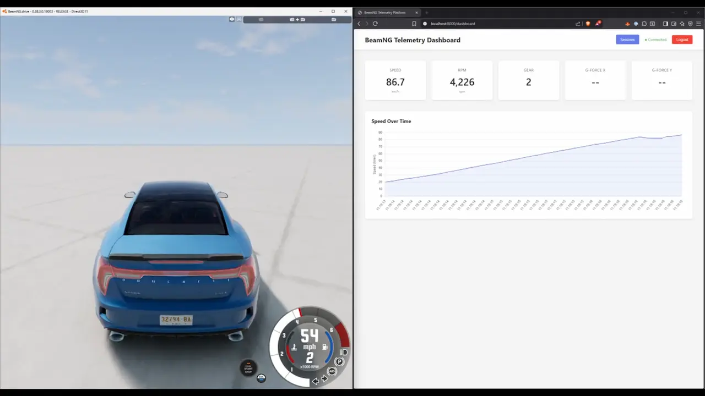

# BeamNG Telemetry Platform

A lean, self-hosted real-time telemetry platform built for BeamNG.drive.

## 🎥 Demo

Watch the platform in action: a BeamNG car driving with real-time telemetry streaming to the dashboard, where speed graphs react live as the vehicle accelerates and decelerates.

[](https://www.youtube.com/watch?v=UZdo-Hee7BQ)

## Features

- Real-time telemetry ingestion via UDP (OutGauge protocol)
- WebSocket streaming to web dashboard
- Session management with automatic start/stop
- PostgreSQL persistence
- Vue 3 frontend with live charts

## Quick Start

### Run with Docker (Full Stack)

The simplest way to run the entire platform:

```bash
docker compose up --build
```

This will:
- Build the backend and frontend
- Start PostgreSQL database
- Start the FastAPI application serving both API and frontend
- Make everything available at `http://localhost:8000`

**Access the application:**
- Web UI: `http://localhost:8000`
- Login credentials: `local` / `local` (or set `SEEDED_USER_PASSWORD` env var)

**Configure BeamNG.drive:**
1. Open BeamNG.drive settings
2. Go to Controls → Advanced → OutGauge
3. Enable OutGauge
4. Set IP to your host machine's IP (or `127.0.0.1` if running locally)
5. Set port to `4444` (default, or match `UDP_PORT` if changed)

The platform will automatically:
- Receive telemetry packets from BeamNG
- Create sessions when you start driving
- Store telemetry frames in PostgreSQL
- Stream real-time data to the web dashboard

### Local Development (Without Docker)

For development with hot-reload:

#### Backend Setup

1. Start PostgreSQL:
```bash
docker compose up -d db
```

2. Install Python dependencies:
```bash
pip install -r requirements.txt
```

3. Run the backend:
```bash
uvicorn app.main:app --reload
```

The API will be available at `http://localhost:8000`

#### Frontend Setup

1. Install dependencies:
```bash
cd frontend
npm install
```

2. Start development server:
```bash
npm run dev
```

The frontend will be available at `http://localhost:5173`

**Note:** In production (Docker), the frontend is built and served from the same container as the backend at `http://localhost:8000`.

## API Endpoints

All API endpoints are prefixed with `/api`:

- `POST /api/auth/login` - Login and get JWT token
- `GET /api/health` - Health check
- `GET /api/telemetry/debug` - Telemetry debug info
- `WS /api/ws/telemetry?token=<jwt>` - WebSocket for real-time telemetry
- `GET /api/sessions` - List all sessions (requires auth)
- `GET /api/sessions/{id}` - Get session detail with frames (requires auth)

## Environment Variables

These can be set in `docker-compose.yml` or as environment variables:

- `DATABASE_URL` - PostgreSQL connection string (default: `postgresql://beamng:beamng@db:5432/beamng_telemetry`)
- `UDP_PORT` - UDP port for telemetry (default: `4444`)
- `JWT_SECRET_KEY` - Secret key for JWT (default: dev key - **change in production**)
- `SEEDED_USER_PASSWORD` - Password for seeded user (default: `"local"`)

When running with Docker Compose, these are configured in `docker-compose.yml`. For local development, set them as environment variables or use the defaults.

## Architecture

- **Modular Monolith** - Feature modules: auth, telemetry, stream, analytics
- **Async First** - Non-blocking UDP ingestion and WebSocket streaming
- **Simple & Maintainable** - KISS principle, minimal dependencies
- **Docker-First** - Full stack runs in containers for easy deployment

## Docker Services

- **app** - FastAPI backend + built Vue frontend (port 8000)
- **db** - PostgreSQL database (internal, no exposed ports needed)

## License

See LICENSE file.
